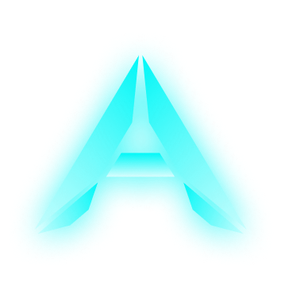
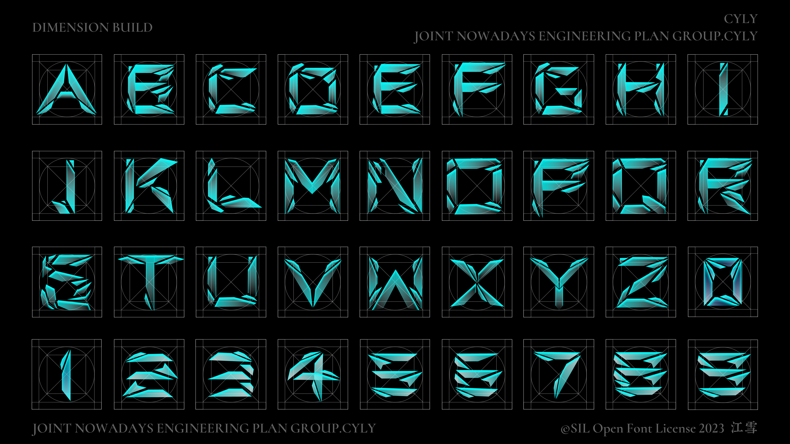

  
  <h2 align="center">Dimension-Build-Font</h2>
  

    <a href="https://github.com/Jiangxue-team/Dimension-Build-Font/releases">Download</a> - 
    <a href="https://github.com/Jiangxue-team/Dimension-Build-Font/issues">Issues</a> - 
    <a href="">License</a>
  

  
It currently only supports uppercase English letters and common symbols. If you have any requests, you can submit them in the Issues section for consideration for future design.

# Introduce

Dimension-Build" font is designed with a cool style to convey messages, as cool designs always give a sense of the future and empower people with a sense of hope and expectation for the future. The design intention of "Dimension-Build Font" is to "build one's own world and ideas." 

We aim to use "Dimension-Build" to give your projects or designs a cool, futuristic style, while embracing the culture of hackers and geeks, and contributing to the open-source movement

# Issues
This font is still under maintenance (which means we will quickly respond to any [issues](https://github.com/Jiangxue-team/Dimension-Build-Font/issues) submitted!), At the initial stage, we have provided support for basic uppercase English letters and commonly used symbols. 

If you want us to support some other letters, you can submit them through [issues](https://github.com/Jiangxue-team/Dimension-Build-Font/issues)!

We guarantee to reply to you in a timely manner and update our progress on this issue in the next version.

# Contributing
If you love this project or the design style, you can open our `Dimension-Build-Font.fig` file using Figma, where you can find the materials needed to build various fonts (since letters are made of several elements).

You can redesign the characters or symbols that you need or that you think are flawed, using the materials we provided, then save the file as a copy and give feedback to us through PR or [issues](https://github.com/Jiangxue-team/Dimension-Build-Font/issues).

We will respond to you as soon as possible and include your contribution in the next release, and thank you for your efforts, also we will become friends and exchange design [issues](https://github.com/Jiangxue-team/Dimension-Build-Font/issues).

If you want to learn font design, after designing in Figma, you can group it and copy it as svg. Then you can replace the corresponding letters in [Birdfont](https://birdfont.org/) and package it, so you will have your own font.

[Birdfont](https://birdfont.org/) is a very simple and lightweight font design software, you can learn it quickly by reading [Create a ligature in Birdfont](https://youtu.be/S6rsphadADY)

# SIL Open Font License
I know you're probably wondering about the licensing for the font. I can assure you that we use the [SIL Open Font License](https://scripts.sil.org/cms/scripts/page.php?site_id=nrsi&id=OFL) for Dimension-Build Font. This means you can use it for free, whether you're an individual, an organization, or a commercial entity."
